# Phanda2 - Entity Relationship Diagram

```mermaid
erDiagram

    %% ============================================
    %% CORE USER & AUTH ENTITIES
    %% ============================================

    users {
        uuid user_id PK
        string full_name
        string email UK
        string phone
        timestamp email_verified_at
        string password
        string remember_token
        enum role "customer | provider | admin"
        timestamp created_at
        timestamp updated_at
    }

    users_profile {
        uuid user_id PK
        string full_name
        string email UK
        string phone UK
        text password
        enum gender "male | female | other"
        string member_id
        enum role "CUSTOMER | PROVIDER | ADMIN"
        enum account_status "ACTIVE | SUSPENDED | DELETED"
        timestamp email_verified_at
        timestamp phone_verified_at
        timestamp last_login_at
        string remember_token
        timestamp created_at
        timestamp updated_at
        timestamp deleted_at
    }

    otps {
        bigint id PK
        uuid user_id FK,UK
        string otp
        string field
        string value
        string purpose
        boolean is_used
        timestamp expires_at
        timestamp created_at
        timestamp updated_at
    }

    login_histories {
        uuid login_history_id PK
        uuid user_id FK
        timestamp login_at
        string ip_address
        text user_agent
        string device
        string location
        string status
        timestamp created_at
        timestamp updated_at
    }

    %% ============================================
    %% USER PROFILE & SETTINGS ENTITIES
    %% ============================================

    addresses {
        uuid address_id PK
        uuid user_id FK
        enum type "home | work | billing | shipping | other"
        string street
        string city
        string province
        string postal_code
        string country
        decimal latitude
        decimal longitude
        boolean is_default
        timestamp created_at
        timestamp updated_at
    }

    locations {
        uuid location_id PK
        uuid user_id FK,UK
        string name
        text address
        enum type "home | work | other"
        boolean is_default
        timestamp created_at
        timestamp updated_at
    }

    settings {
        uuid settings_id PK
        uuid user_id FK,UK
        boolean same_gender_provider
        boolean repeat_providers
        boolean auto_share
        boolean two_factor_auth
        boolean notifications
        json notification_preferences
        timestamp created_at
        timestamp updated_at
    }

    emergency_contacts {
        uuid emergency_contact_id PK
        uuid user_id FK
        string name
        string phone
        string relationship
        boolean is_verified
        timestamp created_at
        timestamp updated_at
    }

    recovery_contacts {
        uuid recovery_contact_id PK
        uuid user_id FK,UK
        string name
        string phone
        string email
        string relationship
        timestamp created_at
        timestamp updated_at
    }

    %% ============================================
    %% PROVIDER ENTITIES
    %% ============================================

    provider_profiles {
        uuid provider_id PK
        uuid user_id FK
        string business_name
        text bio
        integer years_experience
        string service_area
        enum kyc_status "PENDING | APPROVED | REJECTED"
        boolean is_online
        decimal service_radius_km
        decimal last_lat
        decimal last_lng
        decimal rating_avg
        timestamp created_at
        timestamp updated_at
    }

    %% ============================================
    %% SERVICE & CATEGORY ENTITIES
    %% ============================================

    categories {
        uuid id PK
        string name
        string slug UK
        string icon
        text description
        timestamp created_at
        timestamp updated_at
    }

    services {
        uuid service_id PK
        uuid category_id FK
        uuid provider_id FK
        string provider_name
        string title
        text description
        decimal base_price
        integer min_duration
        string location
        decimal rating
        integer reviews_count
        string image
        boolean is_active
        timestamp created_at
        timestamp updated_at
    }

    %% ============================================
    %% BOOKING ENTITIES
    %% ============================================

    bookings {
        uuid id PK
        uuid user_id FK
        uuid service_id FK
        date booking_date
        time start_time
        enum status "pending | confirmed | in_progress | completed | cancelled"
        decimal total_price
        text notes
        string address
        timestamp created_at
        timestamp updated_at
    }

    service_requests {
        uuid booking_id PK
        uuid user_id FK
        uuid service_id FK
        uuid provider_id FK
        uuid address_id FK
        date booking_date
        time start_time
        time end_time
        enum status "pending | confirmed | in_progress | completed | cancelled"
        decimal total_price
        text notes
        string address
        timestamp created_at
        timestamp updated_at
    }

    %% ============================================
    %% MESSAGING ENTITIES
    %% ============================================

    conversations {
        uuid conversation_id PK
        uuid user_id FK
        uuid provider_id FK
        timestamp last_message_time
        timestamp created_at
        timestamp updated_at
    }

    messages {
        uuid message_id PK
        uuid conversation_id FK
        uuid sender_id
        string sender_type
        text message
        boolean is_read
        timestamp created_at
        timestamp updated_at
    }

    %% ============================================
    %% REVIEW & FINANCIAL ENTITIES
    %% ============================================

    service_reviews {
        uuid review_id PK
        uuid booking_id FK,UK
        string service_id
        uuid to_user_id FK
        uuid from_user_id FK
        tinyint rating
        text comment
        timestamp created_at
        timestamp updated_at
    }

    payouts {
        uuid payout_id PK
        uuid provider_id FK
        decimal amount
        char currency
        enum status "SCHEDULED | PAID | FAILED"
        timestamp scheduled_at
        timestamp paid_at
        string reference
        timestamp created_at
        timestamp updated_at
    }

    %% ============================================
    %% DASHBOARD & SYSTEM ENTITIES
    %% ============================================

    user_dashboard_summaries {
        bigint id PK
        uuid user_id FK
        string name UK
        integer bookings_requested
        integer bookings_offered
        integer bookings_accepted
        integer bookings_in_progress
        integer unread_messages
        decimal average_rating
        timestamp last_activity_at
        timestamp created_at
        timestamp updated_at
    }

    %% ============================================
    %% RELATIONSHIPS
    %% ============================================

    %% User core relationships
    users ||--o| provider_profiles : "has profile"
    users ||--o{ addresses : "has"
    users ||--o{ login_histories : "has"
    users ||--o| settings : "has"
    users ||--o| emergency_contacts : "has"
    users ||--o| recovery_contacts : "has"
    users ||--o| locations : "has"
    users ||--o{ otps : "has"
    users ||--o| user_dashboard_summaries : "has"

    %% Provider relationships
    provider_profiles ||--o{ services : "offers"
    provider_profiles ||--o{ conversations : "participates in"
    provider_profiles ||--o{ service_requests : "assigned to"

    %% Category relationships
    categories ||--o{ services : "contains"

    %% Service relationships
    services ||--o{ bookings : "booked as"
    services ||--o{ service_requests : "requested as"

    %% Booking relationships
    users ||--o{ bookings : "makes"
    users ||--o{ service_requests : "requests"
    bookings ||--o| service_reviews : "reviewed in"
    addresses ||--o{ service_requests : "location for"

    %% Review relationships
    users ||--o{ service_reviews : "writes (from_user)"
    users ||--o{ service_reviews : "receives (to_user)"

    %% Conversation & messaging
    users ||--o{ conversations : "participates in"
    conversations ||--o{ messages : "contains"

    %% Financial
    users ||--o{ payouts : "receives"
```

## Relationship Summary

| From | To | Type | Description |
|------|----|------|-------------|
| users | provider_profiles | 1:0..1 | A user optionally has one provider profile |
| users | addresses | 1:N | A user can have multiple addresses |
| users | locations | 1:0..1 | A user has one saved location |
| users | settings | 1:0..1 | A user has one settings record |
| users | emergency_contacts | 1:0..1 | A user has one emergency contact |
| users | recovery_contacts | 1:0..1 | A user has one recovery contact |
| users | login_histories | 1:N | A user has many login records |
| users | otps | 1:N | A user has many OTP records |
| users | bookings | 1:N | A user makes many bookings |
| users | service_requests | 1:N | A user makes many service requests |
| users | conversations | 1:N | A user participates in many conversations |
| users | service_reviews (from) | 1:N | A user writes many reviews |
| users | service_reviews (to) | 1:N | A user receives many reviews |
| users | payouts | 1:N | A provider receives many payouts |
| users | user_dashboard_summaries | 1:0..1 | A user has one dashboard summary |
| provider_profiles | services | 1:N | A provider offers many services |
| provider_profiles | conversations | 1:N | A provider has many conversations |
| provider_profiles | service_requests | 1:N | A provider is assigned many requests |
| categories | services | 1:N | A category contains many services |
| services | bookings | 1:N | A service has many bookings |
| services | service_requests | 1:N | A service has many requests |
| bookings | service_reviews | 1:0..1 | A booking has at most one review |
| addresses | service_requests | 1:N | An address is used for many requests |
| conversations | messages | 1:N | A conversation contains many messages |
